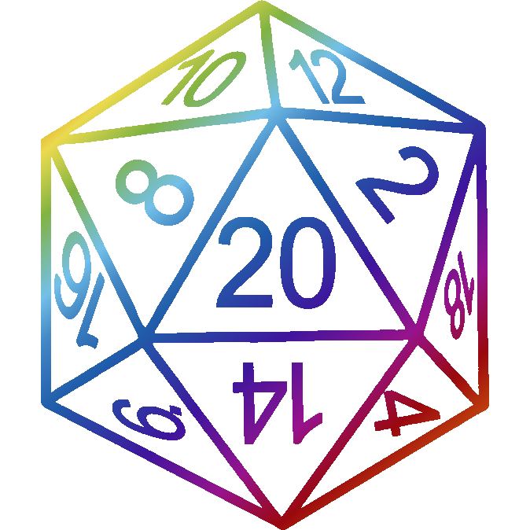
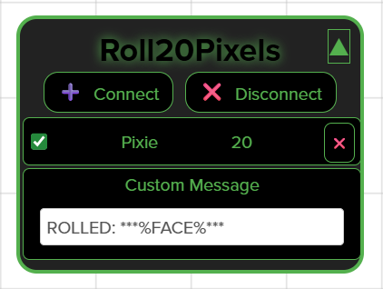

# Roll20Pixels 

This is a Chrome extension that provides a simple interface for connecting [Pixels](https://gamewithpixels.com/) to the [Roll20](https://roll20.net/) website. It enables automatic posting of rolls to the game chat. 

The code is based on the proof-of-concept extension [PixelsRoll20ChromeExtension](https://github.com/Parashoot/PixelsRoll20ChromeExtension).

## What is a Pixel?

Pixels are user-customizable dice containing LEDs. They can be programmed and interacted with using Bluetooth. See the [Game with Pixels](https://gamewithpixels.com/) website or the [API documentation](https://github.com/GameWithPixels/.github/blob/main/doc/DevelopersGuide.md) for more information.

## Install the extension

1. Download the [extension files](https://github.com/mptsolutions/PixelsRoll20ChromeExtension/raw/refs/heads/main/Roll20Pixels.zip).
2. Extract the extension files to a convenient folder.
3. Open the [Chrome extension manager](chrome://extensions/) and enable Developer Mode.
4. Click the "Load Unpacked" button and select the folder you extracted the extension to.

## How To Use

1. Join a game on [Roll20](https://roll20.net/).
2. Click on the Extensions icon in Chrome's address bar.
3. Click the pin icon next to Roll20Pixels extension.
   * This will pin the Roll20Pixels icon  to the address bar.
4. Click the Roll20Pixels icon  to open the Pixel connection window.
   * The Pixel connection window floats in the main Roll20 game space. It can be moved around anywhere on the page.
5. Click the Connect button and select a Pixel. Once connected, the Pixel will be listed in the connection window.
   * Continue for each Pixel.
6. Click the checkbox to enable / disable each Pixel that should be included in rolls.

## Notes
   * Connections are lost when the Roll20 page is reloaded.
